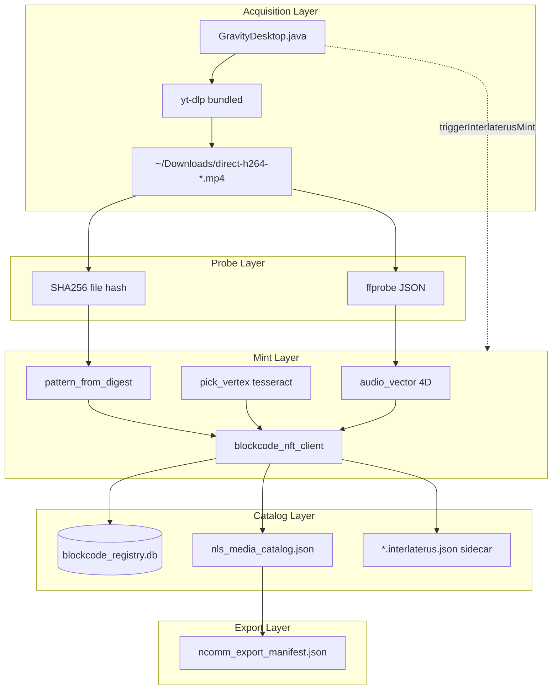
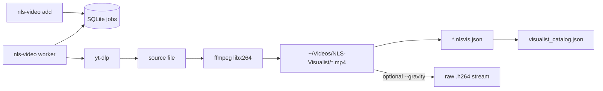
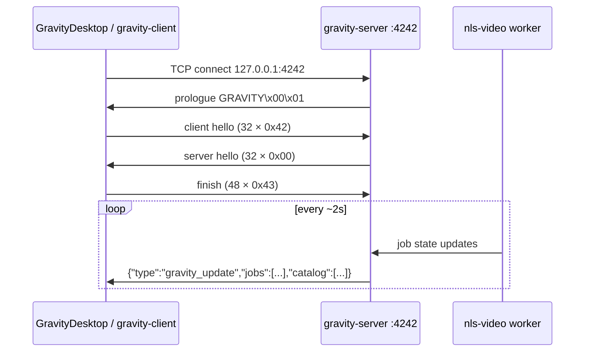

# Architecture — NLS Video Monitor & InterlaterusDesktop

## Overview

The system implements a **vertical integration stack** (InterlaterusDesktop): media acquisition flows downward through probe, mint, and catalog layers. A parallel **horizontal pipeline** (nls-video worker) handles queued download→convert→visualist catalog with optional gravity preparation.

Two client surfaces connect to the same backend protocol:

- **GravityDesktop** (Java Swing) — native window, direct yt-dlp bar
- **gravity-client** (Python Rich TUI) — terminal window with identical handshake

## Vertical architecture (InterlaterusDesktop)



### Stage summary

| Stage | Input | Output | Owner |
|-------|-------|--------|-------|
| Download | URL / viewkey / remote PHP | `direct-h264-<id>.mp4` or `direct-gif-<id>.gif` | GravityDesktop |
| Probe | Media file | duration, codecs, bitrate, resolution, sha256 | interlaterus_desktop |
| Mint | Probe + digest | pattern_code, vertex, NFT record | blockcode_nft_client |
| Catalog | Mint record | SQLite + JSON + sidecar | interlaterus_desktop |
| Export | All records | NCOMM manifest | `interlaterus_desktop export` |

## Horizontal architecture (nls-video pipeline)



### Presets

| Preset | Encoder | Notes |
|--------|---------|-------|
| `balanced-4k` | veryfast, crf 19 | Default speed/quality |
| `hq-4k` | medium, crf 18 | Slower, better compression |
| `fast-1080` | veryfast, crf 23, scale 1080p | Proxies |
| `interstellar-nonlinear` | VP56 path via SCIS vcodec | Optional artistic branch |

## Gravity protocol architecture

Inspired by SCIS **noiseprotocol** gravity transport. Desktop clients are **viewers** on live pipeline state; they do not execute server-side jobs directly (except GravityDesktop's independent yt-dlp bar).



### gravity-server

- Command: `nls-video gravity-server --port 4242`
- Thread per client; broadcasts JSON lines
- Payload: active jobs (download/convert progress) + visualist catalog slice

### gravity-client

- Command: `nls-video gravity-client --port 4242`
- Rich Layout: header (KISS flow), jobs table, visualist panel, URL input bar, status
- Handshake identical to GravityDesktop

### prepare_for_noise_gravity

```python
ffmpeg -y -i video.mp4 -c:v copy -f h264 output.h264
```

Extracts elementary H.264 NAL stream for Noise CipherState packet protection (SCIS analog to VP56 prep). Used by `nls-video catalog --gravity` and worker completion hooks.

## Component dependency graph

```
                    ┌──────────────────┐
                    │ hierarchy_interpreter │
                    │ (11D explorer)   │
                    └────────┬─────────┘
                             │ nls-video hierarchy
┌──────────────┐    ┌────────▼─────────┐    ┌─────────────────┐
│ GravityDesktop│◄──►│  nls_video_pipe  │◄──►│ blockcode_nft   │
│   (Java)     │    │  gravity-server  │    │ _client (py)    │
└──────┬───────┘    └────────┬─────────┘    └────────▲────────┘
       │                     │                       │
       │ spawn mint          │ worker/serve          │ import
       ▼                     ▼                       │
┌──────────────────────────────────────────────────┴──┐
│              interlaterus_desktop.py                 │
│         probe · mint · watch · export                │
└─────────────────────────────────────────────────────┘
```

## Data stores

| Store | Format | Scope |
|-------|--------|-------|
| `~/.config/nls-video/config.json` | JSON | Pipeline config |
| `~/.local/share/nls-video/jobs.db` | SQLite | Job queue |
| `~/.local/share/nls-video/visualist_catalog.json` | JSON array | Worker completions |
| `~/.local/share/interlaterus-desktop/blockcode_registry.db` | SQLite | Blockcode NFTs |
| `~/.local/share/interlaterus-desktop/nls_media_catalog.json` | JSON array | Interlaterus catalog |
| `~/.config/gravity-desktop/remote-nav.tsv` | TSV | Remote PHP nav entries |
| `~/.config/gravity-desktop/cookies.txt` | Netscape | yt-dlp cookies fallback |

## ffprobe / ffmpeg / ffplay roles

| Tool | Where | Purpose |
|------|-------|---------|
| **ffprobe** | interlaterus_desktop, nls_video_pipe | `-show_format -show_streams` JSON; duration for convert % |
| **ffmpeg** | nls_video_pipe worker, GravityDesktop VP56 | libx264 encode, thumbnail, H.264 demux, GIF, libvpx VP56 |
| **ffplay** | Manual | Preview: `ffplay -autoexit file.mp4` (not wired in UI) |

### Probe fields → audio_vector

```
duration_norm = min(duration_sec / 600, 2.0)
size_norm     = min(size_mb / 500, 2.0)
bitrate_norm  = min(bitrate_mbps / 10, 2.0)
aspect_norm   = min(width/height, 2.0)
```

These four floats become `metadata.audio_vector` and `metadata_vector` on the NFT.

## Security & reliability patterns

1. **RateLimiter** (GravityDesktop) — min gap between yt-dlp calls; exponential 403 cooldown
2. **Format pre-check** — `--list-formats` before download; surfaces unavailable H.264 early
3. **Cookie cascade** — browser DB → `cookies.txt` → warn if secretstorage missing
4. **Bundled yt-dlp** — avoids apt stale build missing `--js-runtimes` (rc=2)
5. **SHA256 dedup** — `already_minted` if same file re-processed
6. **no eval** — all subprocess argv lists are static or env-resolved paths

## Deployment topology

```
┌─────────────────────────────────────────────────────────────┐
│ Linux desktop (Ubuntu)                                       │
│                                                              │
│  Terminal A: nls-video worker                                │
│  Terminal B: nls-video gravity-server --port 4242  (opt)     │
│  Terminal C: run-interlaterus.sh watch           (opt)         │
│                                                              │
│  GUI: ~/Downloads/GravityDesktop/run.sh                      │
│       └── connects :4242, downloads to ~/Downloads           │
│                                                              │
│  Browser: nls-video serve → http://127.0.0.1:8765  (opt)     │
└─────────────────────────────────────────────────────────────┘
```

## Extension points

- Post-mint hooks (waveform, IPFS pin, NCOMM SSH push)
- `nls-video catalog --local-file` for adopting external encodes
- Qt migration (GravityDesktop comments reference QtJambi)
- ffplay embed in Swing preview panel
- Unified remote-nav in nls_video_pipe (currently GravityDesktop only)

## See also

- [INTERLATERUS.md](INTERLATERUS.md) — mint commands and catalog schema
- [GRAVITYDESKTOP_JAVA.md](GRAVITYDESKTOP_JAVA.md) — UI and yt-dlp details
- [BLOCKCODE_NFT_CLIENT.md](BLOCKCODE_NFT_CLIENT.md) — tesseract NFT API