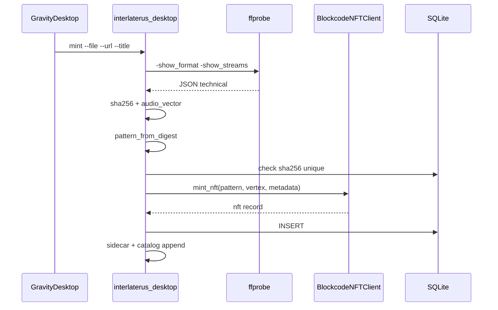

# Blockcode NFT Client

Python port of the tesseract-based NFT client from [nonlineari/Blockcode_NLS_Records](https://github.com/nonlineari/Blockcode_NLS_Records). Addresses media records on a **4D hypercube (tesseract)** using composable **pattern codes**.

## Concept

Each NFT occupies:

1. A **pattern code** — four dot-separated symbols (spatial · rhythm · structure · transform)
2. A **vertex** — `[x, y, z, t]` where each dim ∈ `{0, 1}`
3. **Metadata** — including `audio_vector` (4D float derived from ffprobe)
4. An **owner pattern** — default custodian code

```
Pattern:  ABAB . 2:4 . P←B . F3
          ────   ───   ───   ──
          spatial rhythm struct transform

Vertex:   [0, 1, 0, 1]  →  one of 16 tesseract corners
```

## Code alphabets

| Dimension | Codes |
|-----------|-------|
| Spatial | `AB`, `AABB`, `ABAB`, `ABBA` |
| Rhythm | `2:4`, `3:3`, `4:4`, `5:3` |
| Structure | `P&B`, `P\|B`, `P→B`, `P←B` |
| Transform | `F1`, `F2`, `F3`, `F4` |
| Temporal (quote) | `t_past`, `t_now`, `t_future`, `t_loop` |

## Tesseract geometry

```
        t=0 layer                    t=1 layer
      (0,0,0,0)───(1,0,0,0)        (0,0,0,1)───(1,0,0,1)
         │           │                  │           │
      (0,1,0,0)───(1,1,0,0)        (0,1,0,1)───(1,1,0,1)
         │           │                  │           │
      (0,0,1,0)───(1,0,1,0)        (0,0,1,1)───(1,0,1,1)
         │           │                  │           │
      (0,1,1,0)───(1,1,1,0)        (0,1,1,1)───(1,1,1,1)
```

**Edges:** X, Y, Z, T — one coordinate flip per step.

`calculate_path(from, to)` returns edge types traversed. `hamming_distance` counts differing coordinates.

## API reference

### Construction

```python
from blockcode_nft_client import get_blockcode_nft_client

client = get_blockcode_nft_client("interlaterus-main", [0, 0, 0, 0])
```

### mint_nft

```python
nft = client.mint_nft(
    pattern_code="ABAB.2:4.P←B.F3",
    vertex=[0, 0, 0, 0],
    owner_pattern="AABB.3:3.P|B.F2",
    metadata={
        "title": "Example",
        "audio_vector": [0.05, 0.18, 0.41, 1.78],
        "sha256": "...",
        "technical": { "...": "ffprobe fields" },
    },
)
```

Returns:

```python
{
    "pattern_code": "ABAB.2:4.P←B.F3",
    "vertex": [0, 0, 0, 0],
    "owner_pattern": "AABB.3:3.P|B.F2",
    "metadata": { ... },
    "metadata_vector": [0.05, 0.18, 0.41, 1.78],
    "created_at": "2026-06-25T12:00:00",
    "transfer_history": [],
}
```

Raises `ValueError` if vertex invalid or pattern already exists in in-memory registry.

### Query methods

| Method | Returns |
|--------|---------|
| `get_nft_by_pattern(pattern)` | NFT dict or None |
| `list_nfts()` | All in-memory NFTs |
| `get_nfts_at_vertex(vertex)` | NFTs at coordinates |

### Quote / unquote (transform envelope)

```python
quoted = client.quote({"key": "value"}, "F3")
# QUOTE[F3]:{"key": "value"}

data = client.unquote(quoted)
```

Used for transform-tagged serialization in NCOMM-style transport.

## InterlaterusDesktop integration

`interlaterus_desktop.py`:

1. Loads existing NFTs from SQLite into client registry on each mint
2. Derives `pattern_code` from SHA256 (deterministic)
3. Picks vertex avoiding collisions in DB
4. Sets `metadata_vector` from `audio_vector_from_probe()`
5. Persists to SQLite + writes sidecar + appends catalog

### Owner default

`AABB.3:3.P|B.F2` — custodian pattern for all Interlaterus mints unless overridden.

## Blockcode_mint flow (end-to-end)



## Data analysis tie-in

The **audio_vector** is not audio waveform data — it is a **4D metadata embedding** of probe statistics, named for NLS Records' audio-centric blockcode tradition:

| Vector dim | Probe source | Interpretation |
|------------|--------------|----------------|
| v0 | duration | Temporal scale |
| v1 | file size | Storage mass |
| v2 | bitrate | Information density |
| v3 | aspect ratio | Spatial form |

Future extensions could add MFCC hashes or waveform fingerprints as additional metadata without changing the core pattern/vertex model.

## In-memory vs persistent

`BlockcodeNFTClient.nft_registry` is ephemeral per process. **Persistence** is solely via `interlaterus_desktop` SQLite + JSON catalogs. On restart, `load_client_from_db()` hydrates the registry from `blockcode_nft_records`.

## Example session

```bash
$ python3 interlaterus_desktop.py list
ABAB.2:4.P←B.F3              [0,0,0,0]  direct-h264-04gz1ZId5VI.mp4  2026-06-25T...

$ python3 interlaterus_desktop.py export
/home/user/.local/share/interlaterus-desktop/ncomm_export_manifest.json
```

## Files

| File | Role |
|------|------|
| `blockcode_nft_client.py` | Client class + factory |
| `interlaterus_desktop.py` | Mint orchestration + persistence |

## See also

- [INTERLATERUS.md](INTERLATERUS.md) — watch mode, catalog schemas
- [ARCHITECTURE.md](ARCHITECTURE.md) — vertical stack diagram