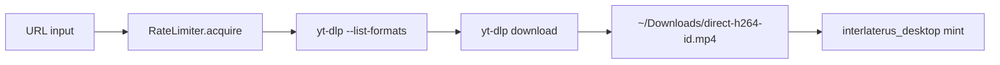

# GravityDesktop (Java)

Swing desktop client for the **Gravity / NoiseProtocol** visualist interface. Connects to `gravity-server` on `127.0.0.1:4242` for live job/catalog updates and provides a **direct yt-dlp download bar** independent of the nls-video worker queue.

## Build & run

```bash
cd ~/Downloads/GravityDesktop
./run.sh          # javac + java GravityDesktop
./check-paths.sh  # dependency audit
```

Source of truth: `~/Downloads/nls-video-monitor/GravityDesktop.java` (synced/copied to run dir).

## Window layout

```
┌────────────────────────────────────────────────────────────┐
│  Header — glitch title + "nonlinear h@k reality" banner    │
├──────────────────────┬─────────────────────────────────────┤
│  Jobs table          │  Visualist catalog (ASC thumbnails)  │
│  (from gravity_update)│  gravity badges                     │
├──────────────────────┴─────────────────────────────────────┤
│  Remote nav panel — viewkey=, menu$N, PHP viewers          │
├────────────────────────────────────────────────────────────┤
│  URL input bar — paste/drag URL, Enter → yt-dlp            │
│  [H.264] [GIF] [rotate] [VP56] [private] [cookies]         │
├────────────────────────────────────────────────────────────┤
│  Status — format probe, download progress, mint result     │
└────────────────────────────────────────────────────────────┘
```

## Gravity protocol client

Handshake (matches `gravity-client` and SCIS noiseprotocol):

| Step | Direction | Payload |
|------|-----------|---------|
| 1 | Server → Client | `GRAVITY\x00\x01` (10 bytes) |
| 2 | Client → Server | 32 × `0x42` |
| 3 | Server → Client | 32 × `0x00` |
| 4 | Client → Server | 48 × `0x43` |
| 5 | Server → Client | JSON lines `{"type":"gravity_update",...}` |

If `gravity-server` is not running, the UI still works; jobs/catalog panels stay empty until connection succeeds.

Start server:

```bash
nls-video gravity-server --port 4242
```

## Direct download pipeline



### Format selection

**H.264 MP4** (default):

```
bv*[vcodec^=avc][ext=mp4]+ba[ext=m4a]/
bv*[vcodec^=avc1]+ba[ext=m4a]/
b[ext=mp4][vcodec^=avc]/
bestvideo[vcodec^=avc]+bestaudio/
best[vcodec^=avc]
```

**GIF:**

```
best[ext=gif]/best
```

Output templates:

- `~/Downloads/direct-h264-%(id)s.mp4`
- `~/Downloads/direct-gif-%(id)s.gif`
- `~/Downloads/direct-h264-rot<N>-%(id)s.mp4` (with rotate)

### Pre-check: `--list-formats`

Before download, runs `yt-dlp --list-formats` to verify H.264 availability and surface errors early (geo block, missing JS runtime, format unavailable).

## yt-dlp resolution order

`YTDLP_PATH` env, then:

1. `$GRAVITY_DESKTOP_HOME/yt-dlp`
2. `~/Downloads/GravityDesktop/yt-dlp`
3. `~/.local/bin/yt-dlp`
4. `/usr/local/bin/yt-dlp`
5. `/usr/bin/yt-dlp`

Bundled binary recommended — system apt copy may lack `--js-runtimes` (exit code 2).

## Rate limiting & 403 handling

| Mechanism | Env var | Default |
|-----------|---------|---------|
| Min request gap | `GRAVITY_MIN_REQUEST_INTERVAL_SEC` | 3s |
| 403 cooldown base | `GRAVITY_403_COOLDOWN_SEC` | 60s |
| 403 retries | `GRAVITY_403_RETRIES` | 2 |
| yt-dlp min sleep | `GRAVITY_MIN_SLEEP_INTERVAL` | 3 |
| yt-dlp max sleep | `GRAVITY_MAX_SLEEP_INTERVAL` | 12 |
| sleep every N requests | `GRAVITY_SLEEP_REQUESTS` | 1 |
| HTTP retry sleep max | `GRAVITY_HTTP_RETRY_SLEEP_MAX` | 60 |

On HTTP 403, cooldown multiplies by consecutive 403 count (cap ×5). Success decrements counter.

## Cookies & private content

Priority:

1. `~/.config/gravity-desktop/cookies.txt` (Netscape format)
2. Browser DB via `--cookies-from-browser` (`GRAVITY_COOKIES_BROWSER`)
3. Auto-detect: brave → chromium → chrome → edge → firefox

**Private checkbox** defaults **off** (only passes `--cookies` when enabled or needed).

Requires `python3-secretstorage` for Chromium-family cookie decrypt:

```bash
sudo apt install python3-secretstorage
```

## VPN / proxy

```bash
export GRAVITY_PROXY=socks5://127.0.0.1:1080
export GRAVITY_GEO_PROXY=socks5://127.0.0.1:1080   # geo-specific
```

Passed to yt-dlp as `--proxy`.

## Remote navigation panel

Persisted: `~/.config/gravity-desktop/remote-nav.tsv`

Supported shorthand:

| Input | Resolves to |
|-------|-------------|
| `viewkey=ABC123` | `GRAVITY_REMOTE_BASE` + viewkey |
| `menu$3` | Menu index on remote site |
| Full URL | Used as-is |
| `remote-cli.php`, `remote.php`, `navi(1)remote.php` | PHP viewer endpoints |

Asset classes: add/delete entries in sync nav menu; URLs feed the same yt-dlp direct bar.

IPFS HTTP gateway prefix: `GRAVITY_IPFS_GATEWAY` (default `https://ipfs.io/ipfs/`).

## ffmpeg integration

| Feature | Command pattern |
|---------|-----------------|
| Rotate 90/180/270 | re-encode libx264 + aac |
| VP56 dual output | `-c:v libvpx` → `.vp56.webm` |

`FFMPEG_PATH` env or `/usr/bin/ffmpeg`.

## JS runtime (YouTube)

GravityDesktop checks Deno/Node for yt-dlp JS challenge solving. UI offers Deno install via `curl -fsSL https://deno.land/install.sh | sh`.

`run.sh` prepends `~/.deno/bin` to PATH.

## Interlaterus mint hook

After successful download:

```java
python3 interlaterus_desktop.py mint --file PATH --url URL --title TITLE
```

Script search path:

1. `$APP_DIR/interlaterus_desktop.py`
2. `~/Downloads/nls-video-monitor/interlaterus_desktop.py`
3. `~/Downloads/GravityDesktop/interlaterus_desktop.py`

Skip: `INTERLATERUS_SKIP_MINT=1`

## ffprobe / ffplay

- **ffprobe** — not called directly from Java; delegated to `interlaterus_desktop.py` on mint
- **ffplay** — not embedded; preview manually: `ffplay -autoexit ~/Downloads/direct-h264-*.mp4`

## Exit codes (yt-dlp)

| rc | Typical cause |
|----|---------------|
| 0 | Success |
| 1 | HTTP 403, geo block, format/cookie failure |
| 2 | Unknown option (stale yt-dlp, missing `--js-runtimes`) |

Status label shows `yt-dlp failed (rc=N)` with stderr excerpt.

## Rules

- **no kill** — does not terminate unrelated processes
- **no eval** — `ProcessBuilder` with fixed argument lists; no `Runtime.exec(String)` shell

## gravity-client equivalence

| Feature | GravityDesktop | gravity-client |
|---------|----------------|----------------|
| Handshake | ✓ | ✓ |
| Jobs panel | Swing JTable | Rich Table |
| Catalog panel | JPanel thumbnails | Rich Text panel |
| URL download bar | ✓ | ✓ |
| Remote nav / VP56 | ✓ | ✗ |
| Cookie UI | ✓ | ✗ |

## Key source references

| Topic | Location in GravityDesktop.java |
|-------|--------------------------------|
| RateLimiter | ~line 59 |
| YTDLP_H264_FORMAT | ~line 52 |
| triggerInterlaterusMint | ~line 451 |
| Direct download thread | ~line 1713 |
| Remote nav | mid-file RemoteNavEntry |
| JS runtime check | ~line 1119 |

## See also

- [Installation.md](Installation.md) — full setup
- [INTERLATERUS.md](INTERLATERUS.md) — mint output
- [ARCHITECTURE.md](ARCHITECTURE.md) — gravity-server architecture