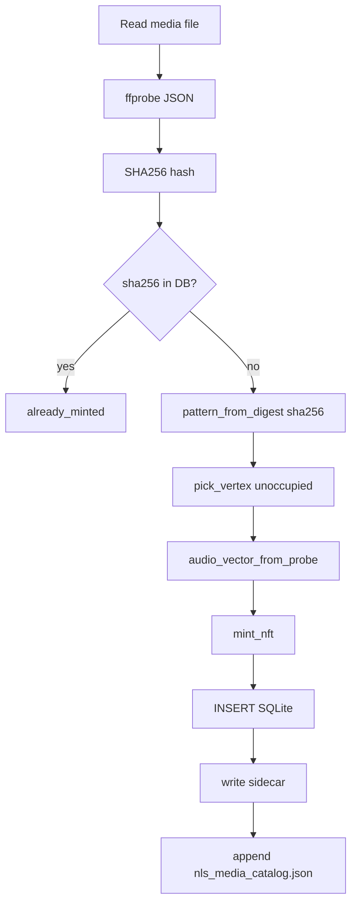

# InterlaterusDesktop — Vertical Integration

InterlaterusDesktop is the **vertical orchestrator** that connects GravityDesktop downloads to Blockcode NFT minting and the NLS media catalog. Name derives from the **interlaterus** (between-layers) integration pattern in the nonlineari portfolio: acquisition, analysis, and catalog layers stacked in one deterministic flow.

## Vertical stack

```
GravityDesktop (download)
       │
       ▼
   ffprobe (media data analysis)
       │
       ▼
blockcode_nft_client (tesseract mint)
       │
       ▼
nls_media_catalog.json + SQLite
       │
       ▼
ncomm_export_manifest.json (optional)
```

## Commands

```bash
# Manual mint
python3 interlaterus_desktop.py mint \
  --file ~/Downloads/direct-h264-04gz1ZId5VI.mp4 \
  --url "https://www.youtube.com/watch?v=04gz1ZId5VI" \
  --title "Example"

# Watch ~/Downloads (same as run-interlaterus.sh watch)
python3 interlaterus_desktop.py watch

# List registry
python3 interlaterus_desktop.py list

# Export NCOMM manifest
python3 interlaterus_desktop.py export
```

Wrapper: `~/Downloads/GravityDesktop/run-interlaterus.sh [watch|list|export|mint]`

## Auto-mint from GravityDesktop

After a successful yt-dlp download, `GravityDesktop.java` calls:

```
python3 interlaterus_desktop.py mint --file PATH --url URL --title TITLE
```

Skip with:

```bash
export INTERLATERUS_SKIP_MINT=1
~/Downloads/GravityDesktop/run.sh
```

Pending metadata (`source_url`, `title`) may be read from `<file>.pending-mint.json` when using watch mode on files downloaded outside the mint hook.

## Watch patterns

Files matching these regexes in `~/Downloads` trigger auto-mint:

| Pattern | Example |
|---------|---------|
| `^direct-h264-.+\.mp4$` | `direct-h264-04gz1ZId5VI.mp4` |
| `^direct-gif-.+\.gif$` | `direct-gif-abc123.gif` |
| `^direct-h264-rot\d+-.+\.mp4$` | `direct-h264-rot90-id.mp4` |

Watch ignores files under 1024 bytes (incomplete downloads). Dedup key: `filename:size`.

## Mint algorithm



### Pattern derivation

From first 8 hex chars of SHA256:

```python
i = int(digest[:8], 16)
pattern = f"{SPATIAL[i%4]}.{RHYTHM[(i>>4)%4]}.{STRUCTURE[(i>>8)%4]}.{TRANSFORM[(i>>12)%4]}"
```

Code sets: `AB|AABB|ABAB|ABBA` · `2:4|3:3|4:4|5:3` · `P&B|P|B|P→B|P←B` · `F1|F2|F3|F4`

Collision on pattern adds suffix: `ABAB.2:4.P←B.F3.a1b2c3`

### Vertex assignment

16 vertices of 4D unit tesseract `[0|1]⁴`. First unoccupied vertex wins; if all 16 taken, round-robin by count.

## Data analysis (ffprobe)

`probe_media()` extracts:

| Field | Source | Use |
|-------|--------|-----|
| `duration_sec` | format.duration | audio_vector[0], metadata |
| `size_bytes` | format.size / stat | audio_vector[1], integrity |
| `bitrate` | format.bit_rate | audio_vector[2] |
| `width`, `height` | video stream | aspect → audio_vector[3] |
| `vcodec`, `acodec` | stream codec_name | technical block |
| `sha256` | file hash | dedup, pattern seed |

### audio_vector normalization

| Index | Formula | Meaning |
|-------|---------|---------|
| 0 | `min(duration/600, 2.0)` | ~10 min = 1.0, cap 2.0 |
| 1 | `min(size_mb/500, 2.0)` | ~500 MB = 1.0 |
| 2 | `min(bitrate_mbps/10, 2.0)` | ~10 Mbps = 1.0 |
| 3 | `min(width/height, 2.0)` | aspect ratio cap |

Example (`direct-h264-04gz1ZId5VI.mp4`):

```json
{
  "pattern_code": "ABAB.2:4.P←B.F3",
  "vertex": [0, 0, 0, 0],
  "audio_vector": [0.0523, 0.1842, 0.4121, 1.7778]
}
```

(Values illustrative — actuals depend on file size/duration at mint time.)

## Output schemas

### SQLite: `blockcode_nft_records`

| Column | Type | Description |
|--------|------|-------------|
| pattern_code | TEXT PK | Blockcode address |
| vertex_x/y/z/t | INT | Tesseract coordinates |
| owner_pattern | TEXT | Default `AABB.3:3.P\|B.F2` |
| metadata_json | TEXT | Full metadata blob |
| media_path | TEXT | Absolute path to file |
| source_url | TEXT | Original URL |
| sha256 | TEXT UNIQUE | Content hash |
| created_at | TEXT | ISO UTC |

### Sidecar: `*.mp4.interlaterus.json`

```json
{
  "pattern_code": "ABAB.2:4.P←B.F3",
  "vertex": [0, 0, 0, 0],
  "owner_pattern": "AABB.3:3.P|B.F2",
  "nft": { "...": "blockcode client record" },
  "probe": { "duration_sec": 31.2, "sha256": "...", "...": "..." },
  "minted_at": "2026-06-25T12:00:00+00:00"
}
```

### Catalog: `nls_media_catalog.json`

Array of summary entries:

```json
{
  "pattern_code": "ABAB.2:4.P←B.F3",
  "vertex": [0, 0, 0, 0],
  "title": "04gz1ZId5VI",
  "source_url": "https://...",
  "media_path": "/home/.../direct-h264-04gz1ZId5VI.mp4",
  "sha256": "...",
  "audio_vector": [0.05, 0.18, 0.41, 1.78],
  "minted_at": "2026-06-25T12:00:00+00:00"
}
```

### NCOMM manifest: `ncomm_export_manifest.json`

```json
{
  "exported_at": "2026-06-25T12:00:00+00:00",
  "origin": "InterlaterusDesktop",
  "transport": "NCOMM/SSH/USB-C (optional)",
  "records": [
    {
      "pattern_code": "...",
      "vertex": [0, 0, 0, 0],
      "media_path": "...",
      "source_url": "...",
      "sha256": "...",
      "created_at": "..."
    }
  ]
}
```

## Paths (XDG)

| Path | Purpose |
|------|---------|
| `~/.config/interlaterus-desktop/` | Config (reserved) |
| `~/.local/share/interlaterus-desktop/blockcode_registry.db` | Registry |
| `~/.local/share/interlaterus-desktop/nls_media_catalog.json` | Catalog |
| `~/.local/share/interlaterus-desktop/ncomm_export_manifest.json` | Export |

## Relationship to nls-video catalog

| Aspect | Interlaterus | nls-video worker |
|--------|--------------|------------------|
| Trigger | GravityDesktop download / watch | Queued jobs |
| Output dir | `~/Downloads` | `~/Videos/NLS-Visualist` |
| Catalog file | `nls_media_catalog.json` | `visualist_catalog.json` |
| Sidecar ext | `.interlaterus.json` | `.nlsvis.json` |
| NFT mint | Yes | No (unless extended) |
| ffmpeg convert | No (uses yt-dlp H.264 direct) | Yes (presets) |

Both can run concurrently; they serve different ingestion paths into the broader NLS Visualist ecosystem.

## Error handling

| Condition | Behavior |
|-----------|----------|
| File missing | `FileNotFoundError` |
| Duplicate sha256 | `status: already_minted` (exit 0) |
| Pattern collision | Append 6-char sha suffix |
| ffprobe failure | Empty probe fields; mint still proceeds with defaults |
| Mint exception in watch | Logged to stderr; loop continues |

## Architectural diagram (catalog flow)

```
┌─────────────┐     ┌──────────────┐     ┌─────────────────────┐
│  Media file │────►│   ffprobe    │────►│  technical + hash   │
└─────────────┘     └──────────────┘     └──────────┬──────────┘
                                                     │
                    ┌──────────────┐                 │
                    │ blockcode    │◄────────────────┘
                    │ mint_nft()   │
                    └──────┬───────┘
                           │
         ┌─────────────────┼─────────────────┐
         ▼                 ▼                 ▼
   ┌──────────┐    ┌──────────────┐   ┌─────────────┐
   │ SQLite   │    │ sidecar JSON │   │ catalog JSON│
   └──────────┘    └──────────────┘   └─────────────┘
```

See [BLOCKCODE_NFT_CLIENT.md](BLOCKCODE_NFT_CLIENT.md) for tesseract API details.