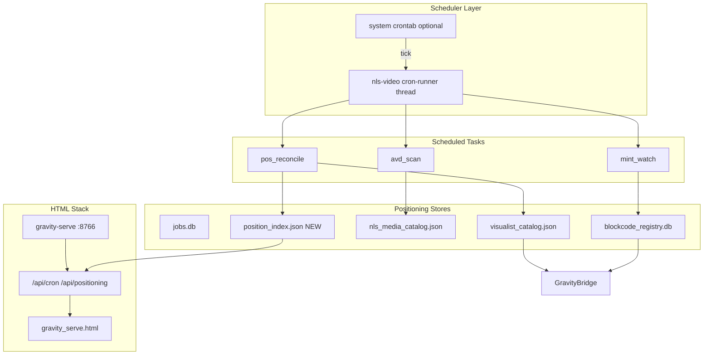
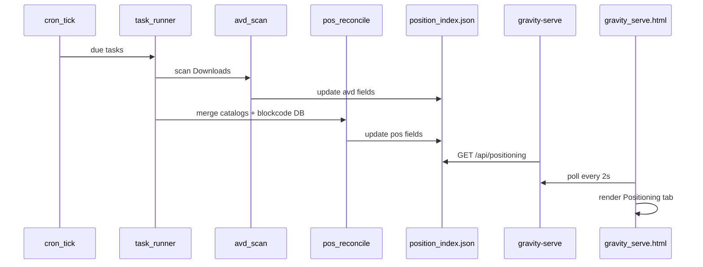

> Extend the existing gravity-serve HTML + nls_video_pipe.py stack with a lightweight cron scheduler that periodically reconciles catalog positioning: AVD (Analog/filmic ASC side) and POS (tesseract vertex + storage_memory_category placement), surfaced in new dashboard tabs and APIs.

# Cron Jobs for AVD/POS Catalog Positioning (Gravity HTML Stack)

## What you confirmed

- **AVD** and **POS** are **catalog positioning concepts**, not Android emulators or retail Point-of-Sale systems.
- Target is the **current stack**: [`gravity_serve.html`](gravity_serve.html) + [`nls_video_pipe.py`](nls_video_pipe.py) + system cron — not a new Node/Workers app.

## Concept mapping (grounded in existing code)

| Term | Meaning in this stack | Existing data |
|------|----------------------|---------------|
| **AVD** (Analog Video Data) | ASC **filmic/analog side** — direct downloads, probe vectors, FILMIC playback path | `asc_mode` in [`_enrich_visualist_item`](nls_video_pipe.py), `~/Downloads/direct-h264-*`, interlaterus probe metadata |
| **POS** (Position) | **Placement** in catalog space — tesseract vertex + storage memory zone | `vertex` in [`interlaterus_desktop.py`](interlaterus_desktop.py) + `storage_memory_category` in [`get_storage_memory_category`](nls_video_pipe.py) |
| **Symmetric view** | ASC (AVD) vs SC (POS) already rendered in ASC Live tab | [`renderAsc`](gravity_serve.html) lines 551–560 |



## Architectural approach

### 1. Two-layer scheduling (not browser cron)

Browsers cannot run real cron. Scheduling lives **server-side**:

| Layer | Role | When to use |
|-------|------|-------------|
| **In-process runner** | Background thread inside `gravity-serve` (or standalone `nls-video cron-runner`) polls due tasks every 30–60s | Dev, always-on dashboard |
| **System crontab** | `*/5 * * * * nls-video cron tick` as a safety net / headless mode | Production, reboot survival |

Both call the same task registry — one code path, two triggers.

### 2. Task registry (new SQLite table, same DB as jobs)

Add `cron_tasks` table to existing [`jobs.db`](nls_video_pipe.py) (or sibling `cron.db` under `~/.local/share/nls-video/`):

```sql
cron_tasks (
  id, name, task_type,   -- mint_watch | pos_reconcile | avd_scan
  schedule_cron,         -- "*/10 * * * *" or interval_sec
  enabled, last_run, next_run, last_status, last_error, config_json
)
cron_runs (id, task_id, started, finished, status, result_json)  -- audit log
```

Default seed tasks on first run:

- **mint_watch** — every 10 min: scan `~/Downloads/direct-h264-*`, mint if missing (wraps [`interlaterus_desktop.py watch`](interlaterus_desktop.py) logic)
- **pos_reconcile** — every 30 min: merge vertex + `storage_memory_category` into unified position index
- **avd_scan** — every 15 min: tag analog files with AVD records (probe hash, asc_mode=FILMIC)

### 3. Position index (new canonical POS artifact)

New file: `~/.local/share/nls-video/position_index.json`

Each entry links catalogs:

```json
{
  "id": "sha256-or-pattern",
  "avd": { "path": "~/Downloads/direct-h264-….mp4", "asc_mode": "FILMIC", "probe": {} },
  "pos": { "vertex": [0,1,0,1], "pattern_code": "AB.2:4.P&B.F1", "storage_memory_category": { "zone": "default-zone", ... } },
  "synced_at": "ISO8601"
}
```

**pos_reconcile** reads from three sources and writes one view:

- [`visualist_catalog.json`](nls_video_pipe.py) — worker outputs + `storage_memory_category`
- [`nls_media_catalog.json`](interlaterus_desktop.py) — interlaterus mints + `vertex`
- [`blockcode_registry.db`](interlaterus_desktop.py) — authoritative vertex occupancy

Conflict rule: **blockcode DB wins for vertex**; **visualist catalog wins for storage_memory_category**; AVD path from newest file mtime.

### 4. Task implementations (reuse, don't rewrite)

| Task | Reuses | Does |
|------|--------|------|
| `mint_watch` | `interlaterus_desktop.mint_media_file` | Idempotent mint for new downloads |
| `avd_scan` | `probe_media`, `_recent_downloads_list` | Build/update AVD side of position_index |
| `pos_reconcile` | `get_storage_memory_category`, `occupied_vertices` | Align POS fields; flag orphans (mint without catalog, catalog without vertex) |

No new mint/blockcode logic — only orchestration and indexing.

### 5. API surface (extend gravity-serve Handler)

New endpoints in [`cmd_gravity_serve`](nls_video_pipe.py):

| Method | Path | Purpose |
|--------|------|---------|
| GET | `/api/cron` | List tasks + last run status |
| GET | `/api/cron/runs` | Recent run log (tail 50) |
| POST | `/api/cron/run` | Manual trigger `{ "task_id": N }` |
| POST | `/api/cron/toggle` | Enable/disable task |
| GET | `/api/positioning` | Full or filtered position_index (AVD/POS pairs) |
| GET | `/api/positioning/orphans` | Items missing AVD or POS half |

Existing [`/api/gravity`](nls_video_pipe.py) enrichment extended to attach `position` summary per catalog item (vertex + zone) so ASC Live tab stays in sync without extra poll.

### 6. HTML stack changes ([`gravity_serve.html`](gravity_serve.html))

Add two tabs (same polling pattern as Jobs — 2s interval):

**Scheduled tab**
- Table: task name, cron expression, last run, status, next run
- Buttons: Run now, Enable/Disable
- Mirrors existing jobs table UX (cancel button pattern)

**Positioning tab**
- Split panel: **AVD (ASC filmic)** | **POS (vertex + zone)**
- Rows from `/api/positioning`
- Orphan badges (e.g. "POS missing", "AVD stale")
- Optional: simple vertex grid 4×4 heatmap (16 tesseract cells, occupied count)

ASC Live tab enhancement: include `vertex` and full `storage_memory_category` per catalog row (today only shows `zone`).

### 7. CLI + crontab wiring

New subcommands in [`nls_video_pipe.py`](nls_video_pipe.py):

```bash
nls-video cron list
nls-video cron tick          # run all due tasks once (for crontab)
nls-video cron run --id 2    # manual
nls-video cron-runner        # foreground daemon (alternative to in-process thread)
```

Example crontab entry (document in [`Installation.md`](Installation.md)):

```cron
*/10 * * * * /usr/bin/nls-video cron tick >> ~/.local/share/nls-video/cron.log 2>&1
```

[`run-gravity-serve.sh`](run-gravity-serve.sh) optionally starts in-process cron thread via `GRAVITY_CRON_ENABLED=1`.

## Data flow for a scheduled tick



## What we explicitly avoid

- Browser `setInterval` as the only scheduler (fine for UI refresh, not for mint/reconcile)
- Separate frontend framework or new database product
- Android adb or retail POS integrations
- Killing long-running worker jobs from cron (cron tasks are **read-mostly reconcile**, not pipeline replacement)

## File touch list

| File | Change |
|------|--------|
| [`nls_video_pipe.py`](nls_video_pipe.py) | `cron_tasks` schema, task runners, APIs, optional in-process scheduler |
| [`gravity_serve.html`](gravity_serve.html) | Scheduled + Positioning tabs, poll handlers |
| [`interlaterus_desktop.py`](interlaterus_desktop.py) | Extract mint-watch loop into callable `run_watch_once()` (no duplicate logic) |
| [`run-gravity-serve.sh`](run-gravity-serve.sh) | `GRAVITY_CRON_ENABLED` env |
| [`Installation.md`](Installation.md) | crontab example + AVD/POS glossary |
| [`ARCHITECTURE.md`](ARCHITECTURE.md) | scheduler diagram + position_index doc |

## Phased delivery

**Phase 1 — Foundation**
- SQLite cron registry + `cron tick` CLI
- `pos_reconcile` + `position_index.json`
- `/api/positioning` + Positioning tab

**Phase 2 — Automation**
- `mint_watch` + `avd_scan` tasks
- `/api/cron` + Scheduled tab + manual run
- In-process scheduler in gravity-serve

**Phase 3 — Ops**
- System crontab template, run logs, orphan alerts in UI
- ASC Live enrichment with vertex/zone

## Success criteria

- Cron tick updates `position_index.json` without manual steps
- gravity-serve Positioning tab shows matched AVD↔POS pairs
- Orphaned mints (vertex but no file, or file but no vertex) are visible
- `nls-video cron tick` is safe to run from crontab (idempotent, no duplicate mints)
- Existing worker / direct download / cancel flows remain unchanged

## Todos

- [ ] **cron-schema** — Add cron_tasks + cron_runs SQLite schema and seed default tasks (mint_watch, pos_reconcile, avd_scan)
- [ ] **position-index** — Implement position_index.json builder: pos_reconcile merges visualist + interlaterus + blockcode DB
- [ ] **task-runners** — Extract interlaterus watch into run_watch_once(); implement avd_scan and cron tick runner
- [ ] **api-endpoints** — Add /api/cron, /api/cron/run, /api/positioning to gravity-serve Handler
- [ ] **html-tabs** — Add Scheduled + Positioning tabs to gravity_serve.html with 2s polling
- [ ] **ops-wiring** — Document crontab in Installation.md; GRAVITY_CRON_ENABLED in run-gravity-serve.sh
